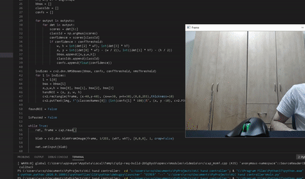

# Fingers-Counter
Simple fingers counter based on opencv

 
 
 

# What it does
You place your fist in the camera. And then stretch your fingers  and it counts them down.

# How it works
The program detects your fist using Convolutional Neural Network (yolov3). And then create an ROI (Range Of Interest) 
in this ROI we detect angles between contours that under 100 degrees. 
For every angle we found we add up 1 finger (Starting from 2).  

# Disclaimer
This method is not very good because we cant count 1 finger because there's no angles to detect.
A better method would be creating a polygon in the center of the ROI. 
And counting contours that outside of the polygon.
